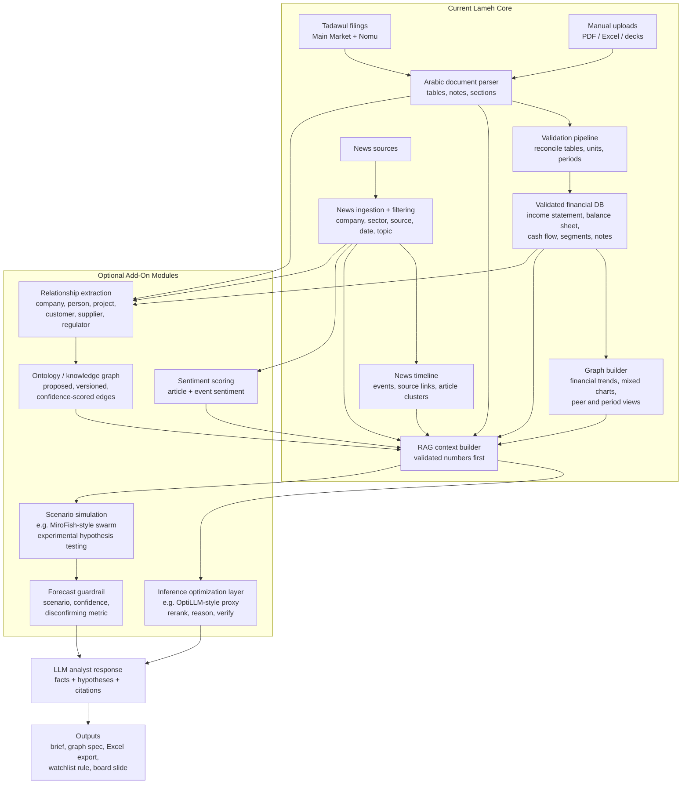
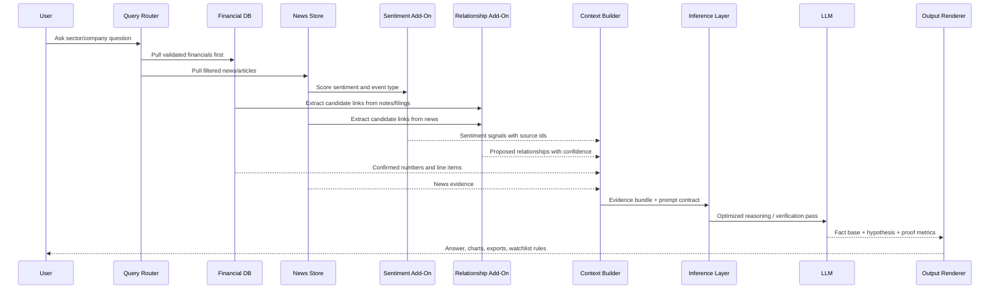

# Lameh Advanced GCC Analyst Prompt Library

Concise prompt library for turning Lameh's existing filing database, validated numbers, graph builder, Arabic parser, filtered news, and exports into analyst-grade research workflows.

Assume the product already supports:

- Tadawul Main Market + Nomu filings, validated tables, Excel exports, and Arabic parsing.
- Graphs for revenue, segment revenue, COGS as % of revenue, growth, expenses, market share, mixed charts, and related metrics.
- Proposed add-ons: relationship extraction, ontology mapping, sentiment scoring, inference routing, and scenario simulation.
- Filterable news by company, sector, source, event/topic, and date.

The prompts below add the missing layer: expert reasoning across sectors, countries, economic cycles, customer behavior, culture, and geopolitics.

---

## Architecture: Current Core + Add-On Modules

This architecture keeps today's strongest assets at the center: parsed filings, validated financial statements, news filtering, graph building, and LLM analysis. Add-ons such as sentiment scoring, relationship mapping, proposed ontology graphs, inference optimization, and swarm-style scenario simulation should enrich the answer, not become the source of truth.



### Minimal Add-On Sequence



### Add-On Implementation Notes

| Module | MVP Input | MVP Output | Implementation Path | Guardrail |
|---|---|---|---|---|
| Sentiment scoring | article title/body, company ids, topic tags | sentiment, relevance, event type, source id | transformer classifier or LLM structured extraction | never treat sentiment as financial proof |
| Relationship extraction | filing text, board reports, news, announcements | candidate edge: entity A -> relation -> entity B | NER + rules + LLM extraction + human review queue | edges are proposed until source-backed |
| Ontology mapping | candidate relationships and schema | versioned graph edges with confidence | Postgres tables first; graph DB later if needed | co-mention is not causality |
| Inference optimization | evidence bundle and prompt | better reasoning / reranking / verification | OptiLLM-style OpenAI-compatible proxy can sit between app and model | output must cite primary evidence |
| Swarm scenario simulation | scenario seed docs, news, assumptions | competing scenario narratives and probability-like scores | MiroFish-style swarm layer for narrative or behavior simulations | experimental; use for hypotheses, not forecasts |
| Forecast guardrail | historical analogs, scenarios, metrics | base/upside/downside with disconfirming metrics | rules + analyst templates + backtesting | show what would prove the model wrong |

Tool references to evaluate, not assume:

- OptiLLM: OpenAI-compatible optimizing inference proxy for reasoning-time techniques. Reference: https://github.com/algorithmicsuperintelligence/optillm
- MiroFish: swarm-style multi-agent prediction/simulation engine; best treated as experimental scenario analysis. Reference: https://github.com/666ghj/MiroFish

---

## 0. Evidence-First Private-Sector Investor Prompt Pack

These are the first prompts to show skeptical private-sector investors. They are not "AI trend" prompts. They start from hard evidence Lameh already owns: financial statements, board reports, earnings calls, official announcements, and news. Any broader market logic is framed as a hypothesis until the primary data confirms it.

Grounding rule:

```text
Primary evidence:
financial statements + board reports + earnings calls/presentations + official announcements + news archive.

Secondary hypothesis layer:
macro, culture, geopolitics, cross-country read-through, customer behavior, private-market intuition.

Every answer must label:
confirmed fact | filing-backed trend | management claim | news-supported signal | analyst hypothesis | missing proof.
```

Required output for every prompt:

```text
1. Fact base from filings/news.
2. Analyst hypothesis.
3. What financial line item should confirm or reject it.
4. Historical pattern or peer comparison.
5. Proposed relationship mapping for engineers.
6. Suggested graph/export.
```

### 0.1 Engineer Mapping: Evidence to Outcome

| Investor Question | Primary Evidence | Proposed Relationship Edges | Expected Outcome |
|---|---|---|---|
| Is demand real? | revenue, segment revenue, receivables, inventory, gross margin, earnings commentary, demand news | company -> customer_segment, company -> geography, product -> season/event | demand quality score |
| Is profit cash-backed? | net income, operating cash flow, receivables, contract assets, inventory, dividends | company -> project/customer, receivable -> counterparty if known | earnings quality bridge |
| Is expansion working? | capex, new branches/beds/stores, segment margin, board strategy, news on openings | company -> location, asset -> segment, manager -> strategy | expansion ROI tracker |
| Is a news trend investable? | news cluster, linked companies, line-item history, management claims | news_event -> company -> line_item -> peer | hypothesis with proof metric |
| Is a relationship material? | related-party note, customer concentration, tenant/supplier news, contract announcements | person/entity -> company -> transaction/project | economic relevance score |
| Is a cycle turning? | 5-10 year metrics, event tags, price/volume if available, subsequent financial outcomes | macro_event -> sector -> company -> metric | historical analog and scenario |

---

### P01. Real Estate Rate-Cut Timing Model

```text
Question:
If financing conditions improve, which Saudi real estate developers, REITs, banks, cement companies, and home-related retailers should show evidence first?

Primary evidence:
- Financial statements: revenue, segment revenue, receivables, inventory, operating cash flow, debt, finance cost, dividends.
- Board/earnings language: sales velocity, collections, project delivery, occupancy, refinancing, demand commentary.
- News: mortgage offers, bank campaigns, housing demand, property transactions, rate-policy commentary.

Hypothesis:
Lower financing cost should first show up in sales velocity, receivables collection, inventory turnover, refinancing cost, and later in earnings.

Return:
company | sector | confirmed evidence | hypothesis | first metric to move | historical analog | 2q/4q scenario | graph.

Proposed mapping:
rate_news -> bank_campaign -> buyer_affordability -> developer_sales -> receivables/inventory/cash_flow.
```

---

### P02. REIT and Property Income Quality

```text
Question:
Which REITs or property companies have income that is truly cash-covered, and which depend on valuation gains, refinancing, or fragile tenants?

Primary evidence:
- Financial statements: rental income, occupancy if disclosed, valuation gains/losses, finance cost, debt maturity, dividends, cash.
- Board reports: property performance, tenant concentration, occupancy, lease renewals.
- News: anchor tenants, malls, offices, hotels, refinancing, property sales.

Hypothesis:
High yield is attractive only if rental cash flow and refinancing risk support distributions.

Return:
company | recurring income | valuation gain reliance | cash dividend coverage | refinancing risk | tenant/news risk | what breaks the thesis.

Proposed mapping:
property_asset -> tenant/sector/geography -> rental_income -> dividend_coverage.
```

---

### P03. Oil to Government Capex to Contractor Cash Conversion

```text
Question:
When oil/fiscal conditions change, which listed contractors and suppliers actually convert government/project exposure into cash?

Primary evidence:
- Financial statements: revenue, contract assets, receivables, payables, backlog if available, gross margin, operating cash flow.
- Board/earnings language: project execution, delays, customer concentration, government/PIF exposure.
- News/announcements: Aramco, PIF, NEOM, Red Sea, Qiddiya, Diriyah, ROSHN, ministries, municipalities, utilities.

Hypothesis:
Contract wins are only valuable if they turn into cash and stable margins.

Return:
project/customer | linked listed companies | filing evidence | news evidence | revenue impact | receivables risk | cash conversion | lag.

Proposed mapping:
oil/fiscal_news -> government_capex -> project_entity -> contractor/supplier -> revenue/receivables/cash_flow.
```

---

### P04. Petrochemical Downcycle Spillover

```text
Question:
If petrochemical margins stay weak, which non-petrochemical Saudi companies may feel the second-order pressure?

Primary evidence:
- Financial statements: petrochemical margins, capex, receivables, bank provisions, industrial services revenue, logistics revenue.
- Board/earnings language: demand from industrial customers, maintenance shutdowns, project delays.
- News: China demand, product prices, feedstock commentary, industrial city activity.

Hypothesis:
Weak petrochemical profit can reduce supplier volumes, industrial services demand, logistics throughput, bank credit quality, and local spending.

Return:
spillover channel | affected sector | linked companies | primary evidence | hypothesis | line item to watch | confidence.

Proposed mapping:
petchem_company -> supplier/logistics/bank/geography -> revenue/provisions/utilization.
```

---

### P05. Pharmacy and Healthcare Chain Unit Economics

```text
Question:
For large pharmacy or healthcare investments, is growth coming from real store/clinic productivity, acquisitions, or working-capital stretch?

Primary evidence:
- Financial statements: revenue, gross margin, COGS/revenue, inventory, receivables, payables, operating cash flow, leases, debt.
- Board reports: store count, clinic count, acquisitions, integration, payer mix, digital channels.
- Earnings/news: pricing pressure, insurance coverage, prescription demand, new branches, regulation, M&A.

Hypothesis:
Healthcare roll-ups look attractive only if same-store productivity, inventory discipline, and payer collections improve after expansion.

Return:
company | growth source | margin trend | inventory days | receivable days | acquisition/store productivity evidence | risk | next proof metric.

Proposed mapping:
company -> store/clinic/geography/payer/supplier -> revenue/margin/inventory/receivables.
```

---

### P06. Hospital and Medical Services Demand Quality

```text
Question:
Are hospital and medical services companies growing because utilization is improving, or because pricing, payer mix, acquisitions, or one-off demand changed?

Primary evidence:
- Financial statements: segment revenue, gross margin, opex, receivables, capex, leases, depreciation, operating cash flow.
- Board/earnings language: occupancy, bed count, outpatient visits, payer mix, doctor recruitment, expansion.
- News: insurance regulation, new hospitals, medical tourism, public/private health initiatives.

Hypothesis:
The best healthcare growth should show operating leverage without receivables expanding faster than revenue.

Return:
operator | demand driver | margin evidence | receivable quality | expansion burden | payer/regulatory news | thesis status.

Proposed mapping:
hospital_asset -> geography/payer/regulator -> utilization -> revenue/margin/receivables.
```

---

### P07. Food, Retail, and Consumer Inflation Pass-Through

```text
Question:
Which food, grocery, restaurant, and retail companies can pass inflation to customers without damaging volume?

Primary evidence:
- Financial statements: revenue, COGS/revenue, gross margin, inventory, rent/lease costs, opex, cash flow.
- Board/earnings language: pricing, footfall, store count, basket size, promotions, supplier cost.
- News: food inflation, consumer confidence, Ramadan/Eid demand, brand campaigns, wage pressure.

Hypothesis:
Strong consumer businesses show revenue growth without gross margin collapse or inventory buildup.

Return:
company | revenue growth | gross margin defense | inventory signal | promotion pressure | seasonal adjustment | pricing-power verdict.

Proposed mapping:
consumer_event -> product_category/customer_segment -> revenue/gross_margin/inventory.
```

---

### P08. Imported Brand Shift and Distribution Economics

```text
Question:
When a foreign brand category gains share, such as Chinese EVs, consumer electronics, appliances, or budget retail brands, which local listed companies benefit through distribution, financing, insurance, logistics, and service?

Primary evidence:
- Financial statements: segment revenue, gross margin, inventory, finance income, insurance premiums, logistics revenue, working capital.
- Board/earnings language: brand partnerships, distribution rights, service networks, inventory strategy.
- News: Chery/BYD/Geely/MG launches, dealer partnerships, consumer adoption, fleet deals, import volumes, pricing.

Hypothesis:
The investable opportunity is often not the foreign brand itself, but local distribution, financing, service, insurance, and logistics economics.

Return:
brand/category | local listed exposure | evidence | likely line item | inventory risk | margin opportunity | adoption scenario.

Proposed mapping:
foreign_brand/news -> local_distributor/financier/insurer/logistics -> revenue/margin/inventory/finance_income.
```

---

### P09. Logistics, Ports, and Supply Chain Shock Exposure

```text
Question:
Which companies are exposed to shipping disruption, freight inflation, import delays, or rerouting, and which may benefit?

Primary evidence:
- Financial statements: COGS/revenue, inventory, gross margin, logistics revenue, payables, working capital.
- Board/earnings language: supply chain, imports, shipping cost, inventory buffers.
- News: Red Sea disruption, port activity, insurance cost, sanctions, rerouting, freight rates.

Hypothesis:
Import-heavy companies show pressure in inventory and margin; logistics/warehousing may benefit if volumes/rates rise.

Return:
company | exposure channel | primary evidence | news evidence | margin/inventory impact | beneficiary or loser | lag.

Proposed mapping:
geopolitical_event -> route/port/supplier_country -> company -> COGS/inventory/revenue.
```

---

### P10. Hajj, Umrah, and Religious Tourism Beneficiary Chain

```text
Question:
Which listed companies benefit from Hajj/Umrah growth beyond hotels, and does the uplift appear repeatedly in the numbers?

Primary evidence:
- Financial statements: quarterly revenue, segment revenue, gross margin, cash flow across hotels, airlines, catering, food, telecom, payments, healthcare, transport.
- Board/earnings language: seasonality, occupancy, visitor demand, Makkah/Madinah exposure.
- News: visitor numbers, travel capacity, religious tourism policy, hotel occupancy.

Hypothesis:
Durable beneficiaries show recurring seasonal uplift, not only news co-mentions.

Return:
company | exposure type | recurring historical uplift | latest evidence | margin effect | seasonality graph | confidence.

Proposed mapping:
Hajj/Umrah_event -> geography(Makkah/Madinah) -> company_asset/service -> segment_revenue/margin.
```

---

### P11. Education and Training Capacity Utilization

```text
Question:
Which education/training companies are growing through real enrollment and pricing power rather than new capacity that has not matured?

Primary evidence:
- Financial statements: revenue, gross margin, receivables, capex, leases, depreciation, cash flow.
- Board/earnings language: student count, capacity, tuition, new campuses, utilization, scholarship/corporate training demand.
- News: regulation, school calendar, employment/training programs, demographic demand.

Hypothesis:
Good education growth should show utilization and cash collection, not only new campus spend.

Return:
company | enrollment/capacity evidence | margin trend | receivables trend | expansion maturity | regulatory/news signal | watch metric.

Proposed mapping:
campus/program -> student_segment/regulator/employer -> revenue/receivables/margin.
```

---

### P12. Telecom, Data, and Digital Payments Monetization

```text
Question:
Are telecom/data/payment companies converting user growth and digital adoption into margin and cash flow?

Primary evidence:
- Financial statements: service revenue, segment revenue, EBITDA proxy if available, capex, depreciation, receivables, cash flow.
- Board/earnings language: ARPU, subscribers, enterprise contracts, data usage, fintech/payment volume.
- News: 5G, cloud, data centers, tourism roaming, merchant adoption, regulation.

Hypothesis:
Digital adoption is investable only if it appears in ARPU, enterprise revenue, margin, or cash conversion.

Return:
company | adoption claim | financial confirmation | capex burden | cash conversion | customer/merchant relationship evidence | thesis.

Proposed mapping:
digital_event/customer_segment -> telecom/payment_provider -> ARPU/segment_revenue/capex/cash_flow.
```

---

### P13. Insurance and Bank Cycle Stress

```text
Question:
Which banks and insurers are exposed to a change in credit, claims, rates, or sector stress before it becomes obvious in earnings?

Primary evidence:
- Banks: loan growth, deposits, NIM proxy, provisions, NPL commentary, sector exposure where disclosed.
- Insurers: premiums, claims ratio, combined ratio proxy, investment income, receivables.
- Board/earnings language: credit quality, claims inflation, pricing, medical/motor exposure.
- News: rate changes, sector distress, regulation, accidents/weather/healthcare cost pressure.

Hypothesis:
Stress appears first in provisions, claims ratios, receivables, and management language before headline profit turns.

Return:
institution | exposure | early stress metric | filing evidence | news trigger | peer comparison | 2q/4q scenario.

Proposed mapping:
sector/customer_event -> bank/insurer exposure -> provisions/claims/investment_income.
```

---

### P14. Cross-Country GCC Read-Through With Proof Test

```text
Question:
Does a trend in UAE, Qatar, Kuwait, Oman, or Bahrain transfer to Saudi companies, or is it a false comparison?

Primary evidence:
- Saudi target financials and board/earnings language.
- GCC peer filings/results where available.
- News from both markets.

Hypothesis:
Cross-country read-through is only useful if the same customer, funding, regulation, supply chain, tourism, or commodity mechanism exists.

Return:
foreign signal | Saudi linked companies | transferable mechanism | evidence | why it may fail | metric to confirm | confidence.

Proposed mapping:
country_event -> sector_mechanism -> Saudi_peer/company -> line_item.
```

---

### P15. Private Business Diligence From Public Company Evidence

```text
Question:
If I were buying a private business in this sector, what do public Saudi/GCC companies reveal about the economics, cycle timing, and diligence risks?

Primary evidence:
- 5 to 10 years of public peer financials.
- Board reports and earnings commentary.
- News on regulation, customers, suppliers, rents, labor, imports, financing, pricing.

Hypothesis:
Listed peers reveal sector economics that private sellers may not disclose clearly.

Return:
private diligence memo:
sector economics | good business model signals | bad signals | cycle timing | questions to ask seller | public comps | data-backed warnings.

Proposed mapping:
sector -> business_model -> customer/supplier/regulator -> margin/working_capital/cash_flow.
```

---

### P16. Historical Pattern and Forward Outcome Engine

```text
Question:
Find past periods where the current setup looked similar, then estimate plausible outcomes over the next 2 to 4 quarters.

Primary evidence:
- 5 to 10 years of financial metrics for target and peers.
- Board/earnings language across cycles.
- News/event tags for rates, oil, property, healthcare, retail, logistics, regulation, consumer demand, project awards.
- Subsequent financial outcomes after each analog.

Hypothesis:
The forecast should be scenario-based and tied to similar historical evidence, not a single point prediction.

Return:
analog period | similarity | filing/news pattern | what happened next 1q/2q/4q | why today differs | base/upside/downside | trigger metrics.

Proposed mapping:
current_pattern -> historical_event_cluster -> company/sector_metrics -> future_outcome_distribution.
```

---

### P17. "What Would I Have Needed To Know Earlier?"

```text
Question:
For a past winner or loser in any Saudi/GCC sector, what early evidence was visible before the market narrative changed?

Primary evidence:
- filings, board reports, earnings calls, news, peer metrics, proposed relationship outputs if available, price/volume if available.
- revenue, segment revenue, COGS/revenue, gross margin, receivables, inventory, cash flow, debt, finance cost.

Hypothesis:
Good research products should turn past lessons into live watchlist rules.

Return:
early signal | first visible date | source | line item | why it mattered | false positives | current companies showing same pattern.

Proposed mapping:
past_outcome -> early_signal -> source_document/news -> live_company_watchlist_rule.
```

---

## 1. Analyst Reasoning Contract

Every advanced answer starts with the strongest available Lameh evidence: validated financial statements, board reports, earnings calls/presentations, official announcements, and news. The LLM can then generate analyst hypotheses, but it must label them as hypotheses until a filing line item, management statement, or news pattern supports them.

Every advanced answer should do four things:

```text
1. Map the transmission chain:
   evidence -> sector mechanism -> company exposure -> financial line item -> market implication.

2. Separate signal types:
   filing fact, board/earnings claim, news signal, historical analogy, analyst hypothesis, and open question.

3. Use the proposed relationship layer when available:
   expand beyond the target company into peers, customers, suppliers, projects, regulators, board/person links, shareholders, geographies, and macro factors.

4. Produce a reusable artifact:
   causal map, ranked exposure table, graph spec, Excel export spec, watchlist rule, or board-slide summary.
```

Minimal answer shape:

```text
Takeaway:
Primary Evidence:
Hypothesis:
Transmission Chain:
Confirming / Disconfirming Metrics:
Suggested Graphs:
Next Prompt / Terminal Command:
```

---

## 2. Domain Expert Lenses

Use these as retrieval and reasoning expansions before calling the LLM.

| Lens | Analyst Question | Data To Pull |
|---|---|---|
| Rate cycle | Who benefits from lower borrowing costs, and who loses spread income? | finance cost, debt maturity, bank NIM proxy, mortgage news, REIT dividends |
| Oil cycle | Which sectors gain from fiscal strength vs lose from energy/input costs? | oil news, government capex, petrochemical margins, transport cost, subsidy exposure |
| Government capex | Which firms are tied to PIF, giga-projects, ministries, contractors, or infrastructure spend? | contracts, receivables, backlog, project entities, related news |
| Consumer affordability | Are customers more or less able to buy? | wages, financing offers, inflation, installment activity, ticket size, Ramadan/Eid seasonality |
| Tourism and religious travel | Who is exposed to Hajj, Umrah, hotels, airlines, catering, retail, telecom, payments? | visitor news, hotel KPIs, passenger traffic, sector revenues |
| Geopolitical logistics | Who is exposed to Red Sea disruption, shipping insurance, imports, rerouting, inventory build? | inventory, freight-sensitive COGS, supplier geography, port/logistics news |
| FX and peg effects | How do USD/SAR peg and imported input costs flow into margins? | imported COGS, USD debt, international revenue, hedging notes |
| Regulatory change | Which companies are repriced by licensing, Saudization, fees, taxes, tariffs, or ownership rules? | announcements, regulator news, labor cost, compliance cost |
| Cross-country read-through | What do UAE/Qatar/Kuwait/Oman/Bahrain signals imply for Saudi peers? | peer results, property prices, bank lending, tourism, construction awards |
| Historical analog | When did this setup happen before, and what followed? | prior cycles, event windows, price/volume, subsequent filings |

---

## 3. Proposed Relationship / Ontology Expansion Rules

When the user asks about a company, use current filters first. When the relationship layer is implemented, expand the proposed graph before answering.

```text
Target company
-> sector peers
-> suppliers / customers / tenants / contractors
-> related board members and major shareholders
-> projects and government entities
-> regulators
-> countries and cities
-> macro factors
-> historical events with similar relationship patterns
```

Add these relationship types if missing:

```text
exposed_to
beneficiary_of
hurt_by
passes_cost_to
price_taker_of
funded_by
supplies_to
depends_on_project
competes_with
shares_customer_base
shares_board_member
related_party_to
regulated_by
co_mentioned_with
historical_analog_of
```

Important: `co_mentioned_with` is not causality. Prompts must ask the model to explain whether the relationship is causal, coincidental, or only a news association.

---

## 4. Advanced Prompt Templates

### A01. Connect-the-Dots Analyst Brief

```text
User question:
{{question}}

Act as a GCC sector analyst. Do not summarize documents one by one.

Use Lameh's current filters and proposed relationship layer to expand from {{company_or_sector}} into:
- peers
- suppliers/customers
- projects
- countries/geographies
- regulators
- macro factors
- related news events
- historical analogs

Return:
1. One-line analyst takeaway.
2. Causal chain: event -> sector mechanism -> company exposure -> financial line item.
3. Evidence table: confirmed data / news / management claim / inference.
4. Second-order effects.
5. What would disprove the thesis.
6. Graphs Lameh should render.
7. A terminal command to reproduce the workflow.
```

Best for:

- "Why should I care about this news?"
- "What is the hidden read-through for Saudi listed companies?"
- "What does this imply beyond the obvious company?"

---

### A02. Rate Cut Transmission for Real Estate and Banks

```text
Question:
If mortgage rates or policy rates fall, which Saudi-listed companies are most exposed?

Retrieve:
- Real estate developers, REITs, banks, mortgage lenders, building materials, cement, insurers.
- Debt maturity, finance cost, dividend coverage, occupancy, rental income, off-plan sales, receivables.
- Mortgage/rate news and bank financing campaigns.
- Historical periods with falling rates or easing credit.

Analyze:
- Developers: affordability -> sales velocity -> cash collection -> inventory reduction.
- REITs: refinancing cost -> FFO/dividend coverage -> yield repricing.
- Banks: mortgage volume growth vs margin compression.
- Cement/materials: construction activity lag.
- Insurers: mortgage-linked protection products if data exists.

Return:
Ranked exposure table + causal map + historical analog + charts:
1. finance cost / revenue
2. debt maturity wall
3. dividend coverage
4. real estate sales or rental income trend
5. rate-news sentiment timeline
```

Terminal idea:

```text
/transmission rates --market saudi --focus real-estate,banks --period 12q --analog prior-easing-cycles
```

---

### A03. Oil Price Read-Through Map

```text
Question:
What does an oil price move imply for Saudi sectors beyond energy?

Retrieve:
- Oil-price trend and related news.
- Fiscal/project spending news.
- Petrochemicals, logistics, airlines, consumer, banks, cement, construction, REITs.
- Historical oil drawdown/rally windows.

Analyze:
- Direct: energy revenue, petrochemical spreads, fuel/feedstock exposure.
- Fiscal: government capex, project awards, contractor backlog, receivables risk.
- Consumer: confidence, employment, disposable income, retail spend.
- Banking: liquidity, deposits, credit growth, provisions.
- Market liquidity: IPO pipeline, foreign flows, risk appetite.

Return:
Cross-sector heatmap: beneficiary / neutral / pressured / uncertain.
Include line-item impact and expected lag.
```

---

### A04. Giga-Project and Government Capex Dependency

```text
Question:
Which listed companies are truly exposed to Vision 2030 / PIF / giga-project spending?

Retrieve:
- Announced contracts, customers, counterparties, receivables, backlog, segment revenue.
- News and filings mentioning PIF, NEOM, Red Sea, Qiddiya, Diriyah, ROSHN, ministries, municipalities.
- Proposed supplier/customer links.

Analyze:
- Separate real exposure from marketing language.
- Score dependency:
  1. named contract with value
  2. named contract without value
  3. supplier/customer relationship
  4. sector-level beneficiary only
  5. news association only
- Check cash conversion: large project exposure with rising receivables may be lower quality.

Return:
Project exposure ladder + evidence graph + receivables/backlog quality table.
```

---

### A05. Customer Affordability and Cultural Calendar

```text
Question:
Is demand improving because customers are healthier, or because of temporary seasonality/promotions?

Retrieve:
- Retail, food, travel, telecom, autos, real estate, healthcare, education, entertainment.
- Ramadan, Eid, Hajj/Umrah, school calendar, salary cycles, vacation periods.
- Financing offers, inflation news, wages/employment proxies, installment activity if available.
- Segment revenue and gross margin.

Analyze:
- Split demand into structural, seasonal, promotional, financing-driven, and one-off.
- Watch for margin sacrifice: revenue growth with COGS/discount pressure.
- Compare with prior Ramadan/Eid/Hajj windows.
- Use cultural context explicitly, but avoid stereotypes.

Return:
Demand-quality score + seasonality-adjusted explanation + charts:
- revenue growth vs gross margin
- sales by quarter around Ramadan/Eid
- news sentiment around affordability/promotions
```

---

### A06. Cross-Country GCC Read-Through

```text
Question:
What do UAE/Qatar/Kuwait/Oman/Bahrain signals imply for Saudi companies?

Retrieve:
- Same-sector GCC peers.
- Country macro/news: property, banking, tourism, logistics, oil/gas, regulation, rates.
- Saudi target company financials.

Analyze:
- Determine whether the foreign signal is transferable:
  - same customer base?
  - same rate regime?
  - same input costs?
  - same regulation?
  - same tourism/geographic exposure?
  - same project cycle?
- Classify read-through:
  strong, partial, weak, misleading.

Return:
Cross-country read-through table + why transferable/not transferable + Saudi watchlist.
```

Example:

```text
If Dubai real estate sales slow, which Saudi developers or REITs should we watch, and why might the signal fail?
```

---

### A07. Historical Analog Finder

```text
Question:
When has this setup happened before, and what followed?

Inputs:
- current event or metric pattern
- target company/sector
- lookback period

Retrieve:
- prior periods with similar macro event, sector metric, news cluster, price/volume move, or filing language.
- subsequent 1q/2q/4q financial outcomes.

Analyze:
- Match on pattern, not keywords only.
- Show what is similar and what is different.
- Avoid claiming causality from analogy alone.

Return:
Top 3 historical analogs with:
- similarity score
- what happened next
- why today's setup may differ
- charts to compare current vs analog period
```

Implementation note:

- Start with rule-based event tags + metric z-scores.
- Add embedding similarity over event descriptions later.
- Use lagged correlation only as a clue, not proof.

---

### A08. Management Narrative vs Reality

```text
Question:
Is management's explanation consistent with the numbers and external signals?

Retrieve:
- board report, earnings call, presentation, announcements.
- validated financials.
- peer results.
- customer/supplier/regulator/news relationships.

Analyze:
- Extract claims:
  demand, pricing, margins, supply chain, project timing, financing, regulation, strategy.
- Validate against:
  line items, peers, news, relationship-linked entities, historical promises.
- Find omissions:
  major cost/news/relationship changes not discussed by management.

Return:
Claim reality table:
claim | supporting evidence | contradicting evidence | missing context | analyst question.
```

---

### A09. Margin Pressure Source Decomposition

```text
Question:
Where is margin pressure really coming from?

Retrieve:
- revenue, COGS, gross margin, opex, segment margin, inventory, payables.
- supplier geography and commodity links.
- freight/logistics news.
- FX/import exposure.
- peer margins.

Analyze:
- Separate:
  price discounting
  input inflation
  freight/logistics
  labor/Saudization
  inventory write-down
  product mix
  project execution
  regulation/tariff
- Identify whether pressure is company-specific or sector-wide.

Return:
Margin pressure attribution + sector comparison + relationship-linked cost drivers.
```

---

### A10. Geopolitical Logistics Shock

```text
Question:
Which Saudi/GCC companies are exposed to a logistics or geopolitical shock?

Retrieve:
- news tagged Red Sea, shipping, insurance, ports, sanctions, route disruption, border, conflict.
- import-heavy companies, exporters, retailers, manufacturers, logistics firms.
- inventory, COGS, gross margin, working capital, supplier/customer geography.

Analyze:
- Exposure channels:
  import cost, delivery delay, inventory build, pricing power, export rerouting, insurance, demand disruption.
- Identify natural hedges:
  local sourcing, pricing power, long-term contracts, inventory buffers.

Return:
Exposure map + first-order and second-order beneficiaries/losers + evidence confidence.
```

---

### A11. Board and Relationship Influence Network

```text
Question:
Are there governance or relationship patterns that matter economically?

Retrieve:
- board members, executives, major shareholders, related parties.
- other companies connected to the same people/entities.
- related-party transactions.
- news and filings mentioning connected entities.

Analyze:
- Distinguish normal board overlap from economically relevant influence.
- Look for:
  recurring related-party transactions
  connected counterparties
  sudden board changes before strategic/capital actions
  family/group exposure
  cross-company stress transmission

Return:
Relationship graph summary + economic relevance score + questions for manual review.
```

---

### A12. Cross-Sector Contagion / Beneficiary Finder

```text
Question:
If {{sector_or_event}} changes, who benefits outside the obvious sector?

Examples:
- lower mortgage rates -> developers, REITs, banks, cement, insurers, home retail
- Hajj/Umrah growth -> airlines, hotels, food, telecom, payments, healthcare
- new logistics corridor -> ports, warehouses, insurers, industrial land, fuel, cement
- Saudization enforcement -> labor-intensive retail, healthcare, construction, outsourcing

Return:
Obvious beneficiaries, non-obvious beneficiaries, pressured sectors, lag timing, and proof needed.
```

---

## 5. Advanced Output Formats

### 5.1 Causal Map

```text
Node A: {{event}}
Edge: affects through {{mechanism}}
Node B: {{sector}}
Edge: appears in {{financial_line_item}}
Node C: {{company}}
Evidence: {{source}}
Confidence: high/medium/low
Lag: immediate / 1-2 quarters / 1 year+
```

### 5.2 Transmission Table

```text
Driver | Affected sectors | Company exposure | Line item | Expected lag | Evidence | Confidence | Disconfirming signal
```

### 5.3 Expert Board Slide

```text
Title:
So what:
Non-obvious read-through:
Evidence:
Watch next:
Graph to show:
```

### 5.4 Evidence Graph JSON

```json
{
  "thesis": "Lower mortgage rates may improve developer cash collection before margins recover.",
  "nodes": [
    {"id": "rate_cut", "type": "macro_event"},
    {"id": "developer_sales", "type": "operating_metric"},
    {"id": "receivables", "type": "financial_line_item"}
  ],
  "edges": [
    {"from": "rate_cut", "to": "developer_sales", "relationship": "improves_affordability", "confidence": "medium"},
    {"from": "developer_sales", "to": "receivables", "relationship": "may_reduce_collection_pressure", "confidence": "low"}
  ],
  "evidence": [
    {"source_id": "news_123", "claim": "mortgage offers increased"},
    {"source_id": "filing_456", "claim": "receivables rose YoY"}
  ]
}
```

---

## 6. Feature Ideas That Extend Current Systems

### 6.1 Relationship-Weighted News Sentiment

Instead of company-level sentiment only:

```text
Sentiment Impact =
news_sentiment
* entity_relevance
* relationship_strength
* financial_line_item_mapping
* recency_decay
```

Example:

- Negative news about a tenant matters more for a REIT if that tenant is linked to occupancy/rental income.
- Positive mortgage news matters more for a developer with high inventory and weak collections.

Fast implementation:

- Use relationship graph once implemented.
- Add relationship strength: direct filing link = 1.0, named counterparty = 0.8, recurring news link = 0.5, co-mention only = 0.2.
- Map relationship types to financial line items.

### 6.2 Macro Transmission Score

```text
Exposure Score =
direct_metric_exposure
+ relationship_strength
+ historical_sensitivity
+ news_relevance
- data_uncertainty_penalty
```

Implementation:

- `pandas` for scoring.
- `networkx` or existing graph DB for path strength.
- `statsmodels` for lag testing where data is sufficient.
- Keep the UI honest: "historically associated with" instead of "caused by."

### 6.3 Peer Divergence Detector

Detect when a company diverges from peers and force a reason.

```text
If target margin/revenue/cash conversion moves differently from peer median:
1. pull company-specific filings/news
2. pull supplier/customer/project links
3. classify divergence as pricing, cost, mix, accounting, execution, one-off, or unexplained
```

### 6.4 Narrative Drift Detector

Track management language over time.

```text
Watch for:
- "temporary" repeated across multiple quarters
- "challenging market" while peers improve
- strategy language changing without announced reason
- disappearing KPIs
- guidance becoming less numeric
```

Implementation:

- embeddings over management commentary sections.
- phrase-change tracking.
- claim extraction linked to subsequent outcomes.

### 6.5 Cultural and Calendar Adjusted Trends

Add a date dimension for:

- Ramadan.
- Eid al-Fitr.
- Eid al-Adha.
- Hajj.
- school terms.
- salary/payment cycles if available.
- national holidays and major events.

Use it to avoid weak YoY/QoQ explanations in retail, travel, food, telecom, payments, hotels, and healthcare.

### 6.6 Project Dependency Monitor

For companies tied to major projects:

```text
Monitor:
- named project announcements
- contract awards
- receivables growth
- cash conversion
- capex
- hiring
- supplier links
- delays or scope changes in news
```

Output:

```text
project | linked companies | evidence | financial line item | risk | next filing to inspect
```

---

## 7. Product-Ready Research Commands

```text
/connect 4300 --event "mortgage rate cuts" --expand relationships --analog 10y
/readthrough "Dubai property slowdown" --to saudi --sector real-estate
/transmission oil --move -10pct --market saudi --lag 4q
/projects --entity PIF --listed-exposure --quality receivables,backlog,cashflow
/margin-pressure 1211 --decompose cogs,freight,labor,mix,fx --peers auto
/culture-cycle retail --period 5y --events ramadan,eid,school --metrics revenue,gross_margin
/geopolitics "Red Sea shipping disruption" --exposure importers,logistics,retail,manufacturing
/narrative-drift 4001 --sections outlook,strategy,risks --period 12q
/cross-sector "Hajj growth" --beneficiaries airlines,hotels,food,telecom,payments,healthcare
/healthcare-growth --sector pharmacy,hospitals --proof revenue,margin,inventory,receivables,cashflow
/brand-shift "Chinese EVs" --map distributors,banks,insurers,logistics,service --proof inventory,margin,finance_income
/education-utilization --market saudi --proof revenue,receivables,capex,margin --events school,regulation
/telecom-monetization --proof arpu,segment_revenue,capex,cashflow --news 5g,cloud,payments
/insurance-stress --proof premiums,claims,receivables,investment_income --events healthcare_cost,motor,weather
/analog "profit up cashflow down receivables up" --market saudi --lookback 10y
```

---

## 8. Sample Stakeholder-Winning Questions

Use these in demos because they show why Lameh is more than summaries.

1. "If mortgage rates fall, which Saudi companies should show proof first in receivables, inventory, finance cost, or cash flow?"
2. "Which companies mention Vision 2030 or PIF projects, but do not yet show cash-flow evidence?"
3. "A large pharmacy chain is expanding. Is growth coming from real store productivity, acquisitions, or working-capital stretch?"
4. "Are hospitals growing because utilization improved, or because payer mix, pricing, acquisitions, or one-off demand changed?"
5. "Which food and retail companies can pass inflation through without margin damage or inventory buildup?"
6. "Chinese EVs are gaining share. Which Saudi/GCC listed companies benefit through distribution, financing, insurance, logistics, or service, and what filing line item proves it?"
7. "Which education companies are growing through utilization and cash collection, not just new campuses?"
8. "Do telecom/data/payment companies convert digital adoption into ARPU, segment revenue, margin, or cash flow?"
9. "Which insurers or banks show early stress in claims, provisions, receivables, or management language before headline profit turns?"
10. "Find historical periods where revenue rose but cash flow weakened, and show what happened over the next 1, 2, and 4 quarters."

---

## 9. Prompt Design Rules

Keep instructions short and force analytical depth:

```text
Do not summarize. Build a causal explanation.
Do not stop at the company. Expand through proposed relationships where source-backed links exist.
Do not treat news co-mentions as causality.
Do not use peer comparison unless peer transferability is explained.
Do not use historical analogs unless differences are listed.
Do not hide uncertainty. State what would disprove the thesis.
Always return graph specs or terminal commands so the answer becomes a workflow.
```

---

## 10. Minimal Implementation Backlog

1. Add relationship-weighted sentiment using proposed relationship/ontology edges once implemented.
2. Add macro factor nodes: rates, oil, USD/SAR, tourism, Hajj/Umrah, Ramadan/Eid, freight, regulation, government capex.
3. Add line-item mappings for each relationship type.
4. Add historical analog search using event tags + metric z-scores.
5. Add narrative drift detection for board reports and earnings calls.
6. Add peer divergence detector against sector median.
7. Add terminal commands for transmission, read-through, analog, and project dependency workflows.
